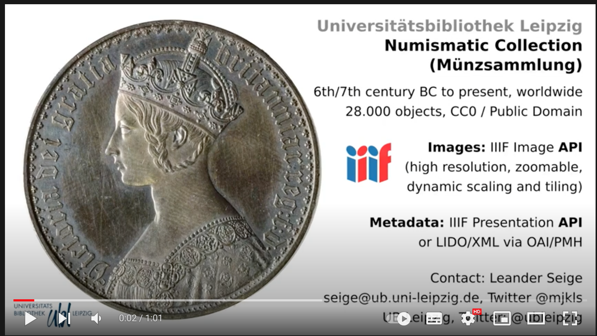

# cdvost3-2022-makeublvideo

This repo contains everything to generate the 1-minute-madness video of the numismatic collection of @ubleipzig for the cultural heritage data hackathon Coding da Vinci Ost³ 2022.

The video was generated on Linux using command line tools only, mostly Shell Script. It requires some popular command line applications such as convert (ImageMagick), FFMPEG and Wget. The script pulls all required images from Leipzig University Library's IIIF server.

The intention of this repo is to give simple examples of how to use command line tools and to demo pragmatic usage of IIIF resources.

Start with ```run.sh```.

## The Video:
<a href="https://codingdavinci.de/de/daten/muenzsammlung-der-ub-leipzig" target="_blank"></a>

